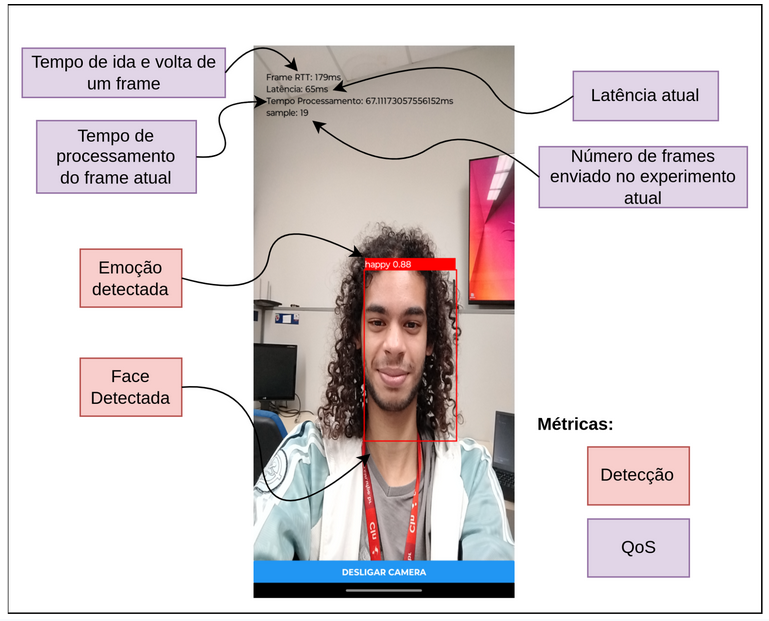

# RemoteVisionNative
RemoteVisionNative é um projeto desenvolvido como parte do Trabalho de Conclusão de Curso (TCC). Ele implementa uma interface mobile para realizar testes de processamento remoto em uma rede, comparando o desempenho entre cloud computing e MEC (Mobile Edge Computing).
Visão Geral

O objetivo do projeto é validar a ideia de processamento remoto e analisar as diferenças de desempenho entre a cloud e a MEC, especialmente para algoritmos de visão computacional que demandam alto poder de processamento, inviável em dispositivos móveis.

## Funcionamento:
- O aplicativo oferece duas opções de processamento remoto: Cloud e MEC.
- Ao escolher uma opção, a câmera frontal do dispositivo é ativada.
- Frames capturados pela câmera são processados com a biblioteca TensorFlow e enviados ao servidor remoto.
- No servidor, os algoritmos de detecção de faces e detecção de sentimentos são executados.
- Os resultados são enviados de volta para o dispositivo.

## Justificativa:
  Algoritmos de visão computacional exigem hardware robusto, o que pode ser inviável em dispositivos móveis. Com MEC, é possível realizar o processamento quase instantaneamente e de forma remota ao dispositivo móvel utilizando 5G, reduzindo a carga no hardware local.
## Tecnologias Utilizadas

- React Native
- TensorFlow
- OpenCV
- [Backend customizado para processamento de visão computacional](https://github.com/mvbs3/RemoteVision)

## Prints do Aplicativo

O gif abaixo mostra o funcionamento da aplicação funcionando com o processamento sendo feito na Cloud:4

Explicação da tela funcional do aplicativo:

## Pré-requisitos:
  - Node.js instalado
  - Gerenciador de pacotes como npm ou yarn
  - Instale o ambiente React Native (siga o guia oficial)

Instale as dependências:

npm install  

Execute o app:

    npx react-native run-android  

ou

    npx react-native run-ios  

to run debug server:
''' npx expo start'''

build apk
''' eas build -p android --profile preview '''

Contribuições

Contribuições são bem-vindas! Para começar:

    Faça um fork do repositório
    Crie uma branch: git checkout -b minha-nova-feature
    Faça as alterações e abra um pull request

Licença

Este projeto está licenciado sob a licença MIT. Veja o arquivo LICENSE para mais detalhes.

